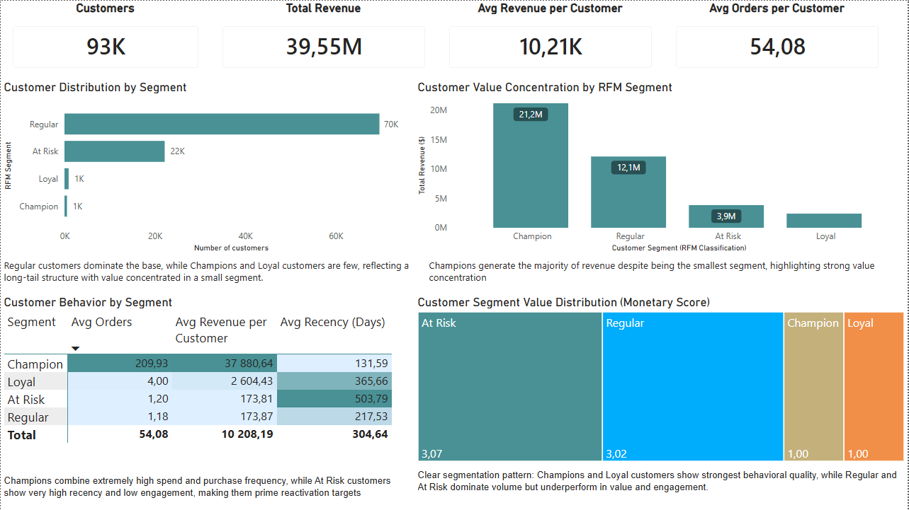

# Olist Brazilian E-Commerce — RFM Customer Segmentation

**Stack:** Excel + Power Query → PostgreSQL (VS Code) → Power BI  
**Dataset:** https://www.kaggle.com/datasets/olistbr/brazilian-ecommerce  
**Focus:** Marketing analytics — RFM customer segmentation, cohort analysis, category behavior, reactivation targeting  

---

## Pipeline

Olist CSV (Kaggle)  
→ Excel + Power Query (data cleaning, joins, RFM scoring)  
→ PostgreSQL in VS Code (validation + SQL analytics layer)  
→ Power BI (dashboard + business insights)

---

## Project Overview

This project builds a full RFM (Recency, Frequency, Monetary) customer segmentation model on the Olist Brazilian e-commerce dataset — approximately 100,000 real transactions from a genuine Brazilian marketplace.

The central business question:  
**Which customers drive revenue, which are at risk of churn, and which should be reactivated?**

A key analytical decision in this project is that RFM segmentation was computed independently in:
- Excel (PERCENTILE + IFS logic)
- PostgreSQL (NTILE window functions)

Query 01 validates both approaches. Champions in Excel consistently align with high NTILE scores (4–5), confirming analytical consistency between spreadsheet logic and SQL-based segmentation.

---

## Dataset

Four core tables from the Olist dataset:

| Table | Description |
|---|---|
| olist_orders_dataset.csv | Order-level data (status, timestamps) |
| olist_customers_dataset.csv | Customer identifiers |
| olist_order_items_dataset.csv | Product-level order items |
| olist_order_payments_dataset.csv | Payment values |

> Raw CSVs are not included due to file size. Available via Kaggle link above.

---

# Pipeline Phases

## Phase 1 — Data Cleaning & RFM Construction (Excel + Power Query)

Four datasets were merged in Excel using Power Query:
orders → customers → order_items → payments.

### Key cleaning decisions:
- Filtered to **delivered orders only** (removes noise from cancellations)
- Replaced `customer_id` with `customer_unique_id` (true customer-level tracking)
- Fixed locale issue in `payment_value` (comma vs dot formatting)

### RFM construction:
Aggregated per `customer_unique_id`:
- Recency → MAX(order date)
- Frequency → COUNT(order_id)
- Monetary → SUM(payment_value)

Scoring:
- 1–5 scale using PERCENTILE + IFS logic
- R_score inverted (lower recency = better score)

### Final segments:
- Champion
- Loyal
- At Risk
- Regular

Output: `olist_rfm.xlsx`

---
## Phase 2 — SQL Analysis & Validation Layer (PostgreSQL)

The Excel-generated RFM dataset was loaded into PostgreSQL for validation and deeper behavioral analysis using SQL.

### Core SQL analysis tasks

| File | Purpose |
|---|---|
| 01_create_tables.sql | Creates raw orders table and final `rfm_analysis` table schema |
| 02_rfm_analysis.sql | Customer segment distribution and revenue contribution analysis |
| 03_rfm_validation.sql | SQL NTILE validation of Excel-based RFM segmentation |
| 04_segment_summary.sql | Revenue, engagement, and recency comparison across segments |
| 05_reactivation_targets.sql | Identifies high-value At Risk and Regular customers for retention campaigns |

---

### Query 01 — Database Schema Setup

The project begins with creation of:
- Raw Olist orders table
- Final `rfm_analysis` table containing:
  - recency
  - frequency
  - monetary metrics
  - RFM scores
  - segment labels

This creates the analytical structure used throughout the SQL phase.

---

### Query 02 — Customer Segment Distribution & Revenue Contribution

This analysis evaluates:
- customer distribution across RFM segments
- total revenue contribution by segment
- average customer value

### Key findings:
- Revenue follows a strong Pareto distribution
- Champions contribute disproportionate revenue despite small population size
- Regular customers dominate volume but not value
- At Risk customers still represent meaningful revenue opportunity

---

### Query 03 — SQL Validation of Excel RFM Logic

Excel-based segmentation was independently validated using SQL window functions (`NTILE(5)`).

### Validation results:
- Champions consistently rank highest in frequency and monetary metrics
- At Risk customers show weak recency but retained historical value
- SQL distributions align closely with Excel scoring logic

👉 Confirms the Excel RFM model is analytically consistent with production-style SQL segmentation.

---

### Query 04 — Segment Performance Summary

Compares customer segments across:
- total revenue
- average revenue per customer
- average orders
- average recency

### Key findings:
- Champions generate the highest customer value and engagement
- Loyal customers show stable mid-tier performance
- Regular customers exhibit low monetization efficiency
- At Risk customers show strongest churn signals

---

### Query 05 — Reactivation Target Identification

Identifies high-value customers with declining engagement behavior.

### Key findings:
- Many high-value At Risk users historically spent significant amounts
- Most exhibit low frequency but large one-time purchases
- Strong opportunity exists for retention and reactivation campaigns

Output exported as:
`05_reactivation_targets.csv`

---

## Phase 3 — Power BI Dashboard & Insights

The Power BI dashboard was built using:
- Excel RFM dataset
- SQL query outputs exported as CSV files

### Dashboard Components

**KPI Overview**
- Customer count by segment
- Revenue distribution
- Average customer value metrics

**Revenue Distribution Analysis**
- Visualization of revenue concentration across RFM segments

**Behavioral Segmentation View**
- Comparison of recency, frequency, and monetary behavior

**Customer Value Profile**
- Engagement vs monetization efficiency by segment

📁 Dashboard Preview:


---

## Key Findings

- Revenue is heavily concentrated among Champion customers
- Regular customers represent high volume but low individual value
- At Risk customers present the strongest retention opportunity
- SQL validation confirms Excel-based segmentation reliability
- Customer behavior separates clearly across RFM dimensions

---

## Limitations

- Dataset reflects a historical 2018 snapshot
- Analysis limited to Brazilian e-commerce market
- Only delivered orders were included
- RFM segmentation is static rather than time-evolving
- Power BI dashboard is not connected to a live database
- SQL layer validates Excel outputs rather than rebuilding transformations from raw data

---

## Further Exploration

- Customer churn prediction modeling
- Time-series RFM migration tracking
- Integration of review sentiment data
- Live PostgreSQL → Power BI connection
- dbt-based transformation pipeline

---

## Repository Structure

```text
olist-rfm-customer-segmentation/
├── README.md
├── data/
│   ├── raw/
│   │   └── .gitkeep
│   ├── cleaned/
│   │   └── olist_rfm.xlsx
│   └── query_outputs/
│       ├── 02_rfm_analysis.csv
│       ├── 03_rfm_validation.csv
│       ├── 04_segment_summary.csv
│       └── 05_reactivation_targets.csv
├── sql/
│   ├── 01_create_tables.sql
│   ├── 02_rfm_analysis.sql
│   ├── 03_rfm_validation.sql
│   ├── 04_segment_summary.sql
│   └── 05_reactivation_targets.sql
├── powerbi/
│   └── olist_rfm_dashboard.pbix
└── visuals/
    └── screenshots/
        └── dashboard.png
```

---

## Tools

| Tool | Purpose |
|---|---|
| Excel + Power Query | Data cleaning and RFM scoring |
| PostgreSQL | SQL validation and behavioral analysis |
| VS Code + SQLTools | Query execution and development |
| Power BI | Dashboarding and business reporting |

---

## Business Use Cases

This project demonstrates practical CRM and marketing analytics applications:

- **Customer retention**
  → Identify At Risk customers for win-back campaigns

- **Revenue optimization**
  → Prioritize Champion customers for loyalty investment

- **Customer lifecycle analysis**
  → Understand behavioral differences across segments

- **Targeted marketing**
  → Build segment-specific campaign strategies

- **Retention analytics**
  → Detect high-value customers showing churn behavior

---

## Data Source

https://www.kaggle.com/datasets/olistbr/brazilian-ecommerce
